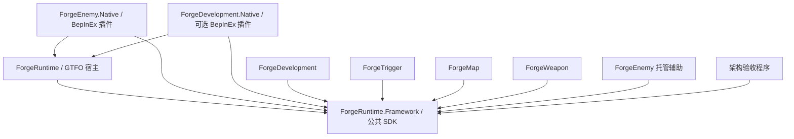

# Forge 模组仓库架构与当前状态

本文件是**本仓库全部状态数字的唯一出处**：构建结果、测试计数、架构断言数、批次位置只在这里写一次。[README.md](README.md) 与 [AGENT-HANDOFF.md](AGENT-HANDOFF.md) 链接到本文，不重复这些数字。以前三份根文档各写一份、互相矛盾的做法已经作废。

上位依据是网站仓库的 [唯一总案 v2.0](../Infini-GTFO-Model-Site/Docs/rework/FORGE-COMPLETE-PLAN.md)。总案第 0–14 节是现行产品与架构裁决，第 31–33 节是生成视图。本文件只描述模组仓库的实际工程结构与进度，不建立第二份产品总案、能力目录或运行注册表。

最后核对时间：2026-09-13。本文中的所有数字都来自各模块 VALIDATION.md 记录的最后一次实际执行，不是持续变化工作树的原子快照。

## 1. 当前构建状态

`dotnet build Forge.Architecture.sln -c Release` 通过，0 警告 0 错误。**完整 GTFO 宿主 `ForgeRuntime/ForgeRuntime.csproj` 现在也通过，0 警告 0 错误**；旧文档反复出现的「10 个既有诊断错误」已由 D1 与 R1 修复，`RuntimeDiagnostics.cs` 现在调用带 epoch 的 `ProjectChecks.Load(_report, epoch, tick)`，`WorldInspection.cs` 不再引用退役的 `Observe` / `CompleteExpectations`。独立的 `ForgeEnemy/Native/ForgeEnemy.Native.csproj` 与 D2 新建的 `ForgeDevelopment/Native/ForgeDevelopment.Native.csproj` 插件工程同样构建通过，0 警告 0 错误。

宿主与 GameBindings 构建需要 `GTFO_BEPINEX_PATH` 或 `-p:GTFOBepInExPath=<BepInEx 目录>` 指向合法的本地编译引用；命令不安装模组。当前使用 .NET SDK 10.0.400 编译仓库的 net6.0 目标，Trigger 的测试工程保留 3 条 NETSDK1138 目标框架生命周期提示，未更改目标框架。

**构建通过不是行为通过。** 至今没有任何一条 binding 完成 GTFO 实机验收；全部证据停留在实现级、托管测试级与元数据级。

## 2. 架构断言数是 36

`ForgeRuntime/tests/Architecture/Program.cs` 当前实际执行 **36** 条断言。旧文档中的 35 是 E1 切换之前的历史快照——切换后新增了「退役的空 Enemy provider 不能与原生 Enemy 并存」与「Enemy provider 身份保留」两条，同时共享 combat 定义从 3 个变为 5 个。任何写 35 的地方都是过期数字。

断言覆盖的边界是：五个领域程序集加一个 SDK 共六个程序集、各自只引用同一份 SDK、都不含 Unity/BepInEx/Harmony 引用、都不内嵌第二个内核、provider 可共存、重复注册以 `provider-conflict` 原子拒绝且不改变 Registry、注册不启动任何工作、注销幂等、共享 `CombatContracts` 注册 5 个 canonical 定义且 0 个 binding。

## 3. 测试计数（各自独立，不相加）

不同套件覆盖不同边界并大量共享底层断言。下表是各套件最后一次记录的通过数，**任何两行都不得相加成"已实现功能数"**。

| 套件 | 最后记录 | 口径说明 |
| --- | --- | --- |
| Architecture | 36 | 编译后真实 DLL 的边界检查 |
| Framework | 253 | **已包含** timing/state 116 与 execution-result 49，不再另加 |
| HostIntegration / LifecycleWork | 53 / 57 | 编译后 SDK + 实际宿主元数据；53 是 D2 后 `--host` 的数字，新增宿主不含诊断的检查 |
| GameBindings：fixtures / bridge / native metadata | 60 / 57 / 51 | 三种模式共享基础断言。51 是 D2 后的 native 数字（模式分派检查换成宿主只有 4 个 Framework Hook）；60 与 57 是 D2 之前的记录。**fixtures 模式当前失败**于 `Unsupported plan version`：网站未提交的 F0 fixture 已把 schemaVersion 改为 2，SDK 仍只接受 1，随 F0 定稿处理 |
| Reports / ProjectChecks / DevelopmentInspection | 99 / 202 / 47 | 诊断侧回归，D2 后位于 `ForgeDevelopment/tests/` |
| SceneInventory / Telemetry / Samples | 8 / 56 / 7 | 诊断侧回归 |
| Shutdown / ReportSnapshots | 31 / 100 | ReportSnapshots 的 100 含保留的原 37 项 |
| 宿主 PluginStartup / HostConfiguration | 35 / 66 | 宿主启动编排与真实 BepInEx 配置文件；D2 移除诊断用例后的数字 |
| Development：PluginStartup / NativeLayout | 54 / 23 | 插件入口编排替身测试；编译后宿主与插件元数据及 10 个 Hook 的 interop 解析 |
| Enemy：receiver / 实体观察 / 插件 / LifecycleFacts | 40 / 66 / 24 / 52 | LifecycleFacts 的 52 覆盖死亡流程与肢体破坏 |
| Enemy：CommitAudit 现行路径 / NativeLayout / 原生静态审计 | 32 / 38 / 112 | 静态审计对应 99 个精确签名 |
| Map：MapIdentity / MapContracts | 126 / 33 | 托管身份实现与 SDK 消费方 |
| Weapon：Identity / IdentityAcceptance / IdentityDispatchReview | 42 场景 99 断言 / 37 / 20 | 三套分别由不同任务编写，复跑于同一份生产实现 |
| Weapon：元数据 / 核验工具 | 312 / 24 | metadata-only 证据等级 |
| Trigger：纯计算与集合 / R3 与空间与筛选 / Acceptance | 1613 / 1529 / 2082 | 三者存在重叠；Acceptance 含可变端口与权重 |
| Trigger：T1 跨语言 | TypeScript 125 + C# 75 | 27 个共享计划 |
| Python（ForgeDevelopment/tests） | 41/41 | 跨端 reader 用例已指向网站现行的 `site/map-balance-report.ts` |

**Trigger 的默认完整入口仍然失败。** `python ForgeTrigger/tools/validate-trigger.py --mutations` 最后一次退出码为 1：pure 与 r3 通过，t1 失败于旧作者元数据入口要求共享 heal 定义也带 `authoring-contract-only` 标记。这是 C 批未关闭的直接门槛，不能用 `--r3-only` 专项通过覆盖。

各模块另有成套的"故意错误实现被检出"记录：编译成功但行为错误的副本必须被具体断言检出，编译失败不计作检错成功。具体条数见各模块 VALIDATION.md。

## 4. 批次位置

原 A–F 批次表按总案 v2.0 的 F0–F10 重新对齐，见第 6 节。当前实际位置：

**A 批（计划与骨架）已完成。** 公共 SDK 独立编译、五个模块工程、架构验收入口与六份实施计划都已存在。

**B 批（真实包边界）基本收口但未关闭。** Runtime 的 R1 编译基线、R2a 公开生命周期、R2b-1 宿主配置与启动隔离已交付；Development 的 D1 诊断接线与入队快照修复已交付；Enemy 的 E1 源码/程序集切换已完成——唯一接收器在 `ForgeEnemy/Native/EnemyModule.cs`，Runtime 不再创建 Enemy provider，`ForgeEnemy/Native/Plugin.cs` 是带 `[BepInPlugin("NAinfini.ForgeEnemy")]` 和 `[BepInDependency("NAinfini.ForgeRuntime","1.2.0")]` 的真实插件。Development 的 D2 切换也已完成到实现与本地验证等级：16 个诊断源、全部诊断测试与 Python 工具迁到 `ForgeDevelopment/`，`ForgeDevelopment/Native/Plugin.cs` 是只在 Runtime `Authoring` 模式下启动的独立插件，宿主不再含诊断。**B 批尚未关闭的是游戏内证据**：Enemy 与 Development 插件都没有在 GTFO 中实际加载过，Development 的三种加载模式未核验。

**C 批（共享合同）进行中。** R3a 的实体观察登记、注销清理与只读保护已在共享 SDK 实际接通；R4a 的可变端口元数据校验与精确 revision 解析已落地；Plan v2 加载器按常量展开 variadic 与 portGroups 后逐项比对 layout，控制节点与 action→action 数据边仍未 lowering。R3、R4 整体未关闭，T1 门槛未过，T2–T7 未完成。

**D 批（首批真实绑定）起步。** Enemy 已有 5 个 binding 与 5 个 Hook 的 implementation-only 接线；Map 的 MAP1b 身份类与 Weapon 的 W1 身份类已在各自生产程序集内，但**两者的 `ModuleDefinition` 仍是空 provider**，没有对外 EntityResolver、游戏 Hook 或可执行 binding，只有显式构造 Session 才登记 resolver。

**E 批与 F 批未开始。**

## 5. 工程与依赖



领域插件单向引用宿主程序集取得 `Plugin.Runtime`，再只使用 SDK 类型；SDK 始终不引用宿主或领域，也不含 Unity/BepInEx 依赖。源码依赖、运行时能力闭包和发布包依赖是三件不同的事。

| 工程 | 当前内容 | 所有权 |
| --- | --- | --- |
| `ForgeRuntime/Framework/ForgeRuntime.Framework.csproj` | 唯一公共 SDK：注册、严格计划、周期/数值 lease、结果合同、实体观察、可变端口元数据 | Runtime |
| `ForgeRuntime/ForgeRuntime.csproj` | GTFO 宿主：模拟时钟、世界/会话桥、启动配置、模块宿主；不含诊断 | Runtime |
| `ForgeRuntime/GameBindings/` | 只剩 3 个文件：`FrameworkFiles.cs`、`GameRuntimeBridge.cs`、`NativeHooks.cs`（`PluginPatchSelection.cs` 已在 D2 删除） | Runtime |
| `ForgeEnemy/Native/ForgeEnemy.Native.csproj` | 真实 BepInEx 插件与唯一 Enemy 接收器、5 个 Hook、原生观察器 | Enemy |
| `ForgeEnemy/ForgeEnemy.csproj` | 托管辅助工程（`Receivers/`、包身份常量），**不是玩家发行包** | Enemy |
| `ForgeMap/ForgeMap.csproj` | 空 provider + 内部身份表/创建票据/生命周期会话 | Map |
| `ForgeWeapon/ForgeWeapon.csproj` | 空 provider + 装备身份索引/会话/进程内票据 | Weapon |
| `ForgeTrigger/ForgeTrigger.csproj` | 空 provider + `Pure/` 纯计算与集合、`Targeting/` 目标与筛选 | Trigger |
| `ForgeDevelopment/Native/ForgeDevelopment.Native.csproj` | 可选 BepInEx 插件：全部诊断、报告、性能采集与 10 个诊断 Hook，只在 `Authoring` 下启动 | Development |
| `ForgeDevelopment/ForgeDevelopment.csproj` | SDK-only 空 provider，排除 `Native/**` | Development |

`Forge.Architecture.sln` 覆盖公共 SDK、五个模块和架构验收程序，特意不代替宿主的完整构建。所有项目沿用 `net6.0`，没有新增 NuGet 包、DI 容器、第二套事件总线或状态机框架。

## 6. 注册入口与身份

只有调用方显式执行 `RuntimeKernel.RegisterModule()` 后才登记 provider；创建对象或加载程序集不启动任何工作。

| 模块 | provider ID | 版本 | 当前注册内容 |
| --- | --- | --- | --- |
| Development | `forge.module.development` | `0.1.0` | 空 |
| Trigger | `forge.module.trigger` | `0.1.0` | 空 |
| Map | `forge.module.gtfo.map` | `0.1.0` | 空；显式 Session 另登记内部 resolver |
| Weapon | `forge.module.gtfo.weapon` | `0.1.0` | 空；显式 Session 另登记 `gtfo.equipment` resolver |
| Enemy | `forge.module.gtfo.enemy` | `1.0.0` | **5 个 binding，由 Native 插件注册** |
| 共享 combat 合同 | `forge.contract.combat` | — | 5 个 canonical 定义，0 个 binding |

`ForgeEnemy/ModuleDefinition.cs` 现在只保留包身份常量，`Create()` 方法已删除，因此不可能与 Native 的真实 provider 重复注册。这些是本仓库的代码身份，不是已核定的 Thunderstore 包 ID 或已发布依赖锁；只有 Runtime 的 `NAinfini.ForgeRuntime`、Enemy 的 `NAinfini.ForgeEnemy` 与 Development 的 `NAinfini.ForgeDevelopment` 是已写入源码的 BepInEx GUID。

共享 `CombatContracts` 的 **5 个** canonical 定义是 `forge.trigger.combat.damage_applied`、`forge.action.combat.heal`、`forge.trigger.combat.health_changed`、`forge.trigger.enemy.death_started`、`forge.trigger.combat.limb_broken`。旧文档写「3 个」的地方是 E3 之前的历史数字。Enemy 相应持有 **5 个** binding 与 **5 个** Hook（Spawned / Despawned / Damage / DeathStarted / LimbBroken），Runtime 保留 **4 个**世界/会话/检查点 Hook，Development 插件另有 **10 个**诊断 Hook。

## 7. 按 v2.0 的 F 阶段重排的批次表

总案第 13.1 节的阶段表覆盖两个仓库。模组仓库承担的部分如下；括号内是总案第 13.2 节的工作单元名。阶段表示依赖顺序，不是工期承诺。

| 阶段 | 模组侧交付 | 独占范围 | 完成门槛 |
| --- | --- | --- | --- |
| **F3 Runtime 执行层**（U-RUNTIME） | 按新 IR 重做唯一调度、事务、状态、结果、预算与 epoch 清理；R3–R6 的共享合同收口 | `ForgeRuntime/Framework/**` | 全宿主构建通过 + 主客机一次执行、准确扣费、恢复 + 性能前后实测对比 |
| **F3N 网络层与社区修复**（U-NET） | 可靠性与去重、权威端判定、迟加入与恢复、带宽与消息预算、能力握手；社区已做过的 GTFO 原生缺陷修复纳入 Runtime | `ForgeRuntime/` 网络与同步层、独立维护的修复清单 | 主客机、迟加入、检查点恢复、主机迁移四类场景通过 + 网络实测前后对比 + 修复清单逐条有来源与验证 |
| **F3/F7 Trigger 原子**（U-TRIGGER） | 94 个通用地基原子先做，再补齐 20 个功能基础包去重后的 244 个原子 | `ForgeTrigger/**` | T1 门槛通过；64 组机制可在游戏内跑通；被替代的外部执行路径删除 |
| **F5 Enemy 接入**（U-ENEMY） | 敌人身份、攻防、AI、技能、生成要求接到同一套 | `ForgeEnemy/**` | 三端出生协作完整场景通过 |
| **F5/F9 Map 接入与模型 Adapter**（U-MAP-MOD） | 空间、任务、设备、玩家流程；**并把地图生成的底层逻辑收进 Forge Map**，运行期由 Forge Map 调用对方模组已加载的模型资源 | `ForgeMap/**` | 生成逻辑归位 + Adapter 调用链；至少三家不同作者的 Geo 包走同一条流程 |
| **F5 Weapon 接入**（U-WEAPON-MOD） | 武器/工具/消耗品三模式接入同一套 | `ForgeWeapon/**` | 三模式各自完整场景通过 |
| **F5 Development**（U-DEV-MOD） | D2 诊断源码从宿主迁出，独立可选插件（已实现并本地验证；游戏内三种加载模式待授权核验） | `ForgeDevelopment/**` | 不装 Development 的普通玩家不启动任何采集 |
| **F8 词表补齐** | 词表从 244 补到 614；variable / state / event / session / authoring 与地基同级优先 | 各领域 | 全部原子有实现与绑定 |
| **F10 发布收口** | 离线包 manifest、依赖闭包、唯一发行结构、替代路径清理 | Runtime + 各领域 | 从网站离线导出到独立测试 profile 的完整闭环 |
| **全程 文档**（U-DOCS-MOD） | 本仓库全部 markdown | 全部 `.md` | 过时陈述清零、矛盾消除、失效引用修复 |

F0（统一节点合同）在网站侧，是全局串行点。它未定稿前 U-RUNTIME 与 U-TRIGGER 的合同相关工作阻塞；U-NET 依赖 U-RUNTIME；U-ENEMY 已在推进中可以继续；U-DOCS-MOD 不阻塞任何单元。

总案允许推翻现有实现重新设计统一节点合同、IR、编译器与 Runtime 执行层。现有 `Framework/` 是可用起点而不是必须保留的结论；不为保留现有代码而妥协结构。

## 8. 两条线在模组侧的落点

**Trigger 类玩法全部原生移植。** 总案第 4.1 节把这条定为设计前提而不是验收后再决定的事：终局是对方模组不再是运行依赖，验收决定的是**何时切换**，不是**是否切换**。模组侧的纪律是——一个副作用只有一个明确执行者，不能双重提交；被替代的执行路径在验收后删除，不留永久兼容层；仍在使用且尚无原生替代的真实依赖，按实际使用如实声明，不提前删除也不虚报。任何把「保留第三方玩法依赖」写成常态的措辞都要按这条口径改写。

**模型类走 Adapter，生成逻辑归 Forge Map。** 总案第 4.2 节把地图生成的底层逻辑划给 ForgeMap，对方 Geo 包降级为纯资源提供方。运行期由 Forge Map 直接读取对方模组已在游戏内加载的模型资源，按玩家拼装结果生成；我们不持有拆解后的资源副本去分发。新接一个包只写一个资源侧 Adapter，不动生成逻辑。这条在 v1.5 时期的模组侧文档里完全没有落点，MAP2 与 MAP9 需要按它重新定范围。

**Trigger 包的优先级与 Runtime 同级。** 旧文档按机制牵头数把 Trigger 排在末位（4/125），那是按「谁牵头哪个机制」记账的结果。Trigger 的节点词汇是覆盖全部领域的横切基座，Map/Weapon/Enemy 各自的机制都落在它提供的原子上。机制牵头责任不变，交付优先级上调。

## 9. 跨领域规则

| 边界 | 唯一所有者 | 协作者如何使用 |
| --- | --- | --- |
| canonical 语义、端口与修订 | 网站 Registry；C# 公共定义按同一合同注册 | 领域只提供自己的 binding，不复制或覆盖 canonical ID |
| 调度、因果、预算、通用状态和结果 | Runtime | 领域提交公开请求，不复制队列或时钟 |
| 网络可靠性、去重、权威判定、迟加入恢复 | Runtime（U-NET） | 领域不各自实现重传或去重 |
| 合法出生空间与拓扑 | Map 的 Room 能力 | Enemy 提交尺寸/移动/碰撞要求，Map 组合遭遇数量/时机/分布 |
| 地图生成的底层逻辑 | Map | 模型来源模组只提供资源，不提供生成 |
| 实体身份与 receiver | 实际拥有该游戏实体的领域模块 | 公共引用含 world/life epoch；不能拿原生指针作内容 ID |
| 装备槽、库存和部署实例 | Weapon | Map 管世界落点与任务物品关联；同一笔成本不能两方各扣一次 |
| 玩家倒地、复活、重生、传送、检查点 | Map 与 Runtime 生命周期 | Heal 不隐式复活，Teleport 不新建 life |
| 诊断与报告 | Development | 普通玩家无采集也能执行玩法 |

source、owner、instigator、recipient 四者不互换。实体种类不决定敌我关系，伤害/治疗极性不决定目标；未知关系、缺失 actor、过期 world/life epoch、不支持的 receiver 都必须给出明确结果。范围 all-target 查询预算不足不得静默截断。所有定时效果分解为事实 → 选择/条件 → 公共 Pulse/Interval → 普通 Action → 结果，不为每种用途写一个计时器。

## 10. 机制牵头分工

保留总案第 33 节的全部 125 组机制。六份实施计划中的队列表是源蓝图的责任索引，只列 ID、名称和已有 Action 引用，不复制参数合同、来源代码或运行支持状态。

| 牵头计划 | 机制数 |
| --- | --- |
| [Runtime](ForgeRuntime/IMPLEMENTATION-PLAN.md) | 2 |
| [Development](ForgeDevelopment/IMPLEMENTATION-PLAN.md) | 4 |
| [Trigger](ForgeTrigger/IMPLEMENTATION-PLAN.md) | 4 |
| [Map](ForgeMap/IMPLEMENTATION-PLAN.md) | 51 |
| [Weapon](ForgeWeapon/IMPLEMENTATION-PLAN.md) | 49 |
| [Enemy](ForgeEnemy/IMPLEMENTATION-PLAN.md) | 15 |

机制牵头数不再用来排交付优先级（见第 8 节）。某机制由 Map 牵头不代表所有场景都需要 Map。125 组机制之外，社区修复类模组的来源盘点是另一类工作，结果单独成表，不混进这 125 组——它归 U-NET，见 [Runtime 实施计划](ForgeRuntime/IMPLEMENTATION-PLAN.md)。

每条机制继续走总案的 M0–M7：冻结证据 → 核验语义与许可 → canonical 分解 → 明确 binding 与权限 → 网站编辑支持 → Runtime 实现 → 真实游戏验证 → 替代清理。失败的 M6 不能通过修改支持标签、忽略错误或改用预览测试绕过。

## 11. 复跑本文的数字

从仓库根目录执行。前两条不需要游戏，后面几条需要合法的本地 BepInEx 编译引用。

```powershell
dotnet build Forge.Architecture.sln -c Release
dotnet run --project ForgeRuntime/tests/Architecture/Architecture.csproj -c Release --no-build
dotnet build ForgeRuntime/ForgeRuntime.csproj -c Release
dotnet run --project ForgeRuntime/tests/Framework/Framework.csproj -c Release -- --fixtures ../Infini-GTFO-Model-Site/Tests/Forge/fixtures/runtime
dotnet run --project ForgeRuntime/tests/GameBindings/GameBindings.csproj -c Release -- --fixtures ../Infini-GTFO-Model-Site/Tests/Forge/fixtures/runtime
python ForgeTrigger/tools/validate-trigger.py --mutations
```

各模块的聚焦复跑入口在各自 VALIDATION.md。构建输出必须使用隔离目录，不写入已安装的 profile，也不写别的 Agent 的 `bin/obj`。

## 12. 本仓库至今没有做过的事

没有启动过 GTFO、没有安装到任何 profile、没有打包发行、没有主客机或迟加入测试、没有检查点恢复或主机迁移验证、没有原生 detour 的实际执行、没有网络实测。全部证据是源码级、托管测试级、静态元数据级。骨架 DLL 与 Native 插件 DLL 都不作为玩家可用发行物。

后续 Agent 的进场次序、文件所有权与委派模板见 [AGENT-HANDOFF.md](AGENT-HANDOFF.md)。
